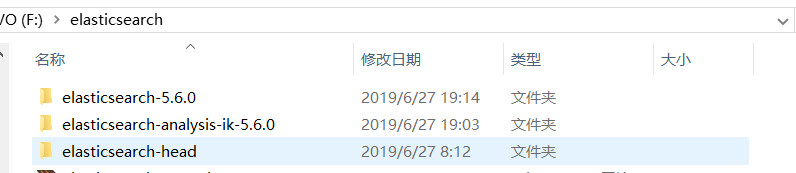
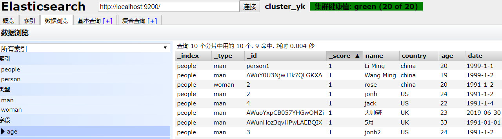
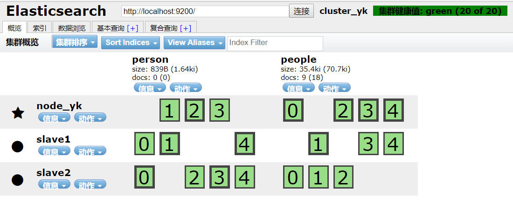

# SpringBoot整合ElasticSearch

此项目仅仅是用SpringBoot集成ElasticSearch并进行增删改查

## 学习必读

### 项目环境	
1. 视频课程地址：

    https://www.imooc.com/learn/889

课程名字： ElasticSearch入门
课程封面：

2.此项目所用的环境
系统及编译器：win10+idea+maven
框架：SpringBoot1.5.9+elasticSearch5.6.0+ik分词器5.6.0
elasticsearch插件：elasticsearch-head
（1）切记，如果是看此视频学习，千万不要用elasticSearch6.0以上的新版本，因为elasticSearch版本差异非常大，开始我是安装的最新的elasticSearch7.x，结果按照老师教程也好，网上教程也好，建立索引都报语法错误，开始一直在找错误，最后发现是版本语法问题。
       所以学习此课程建议安装elasticsearch5.x。
（2）安装elasticsearch-head需要nodejs环境
3.项目部分截图
（1）文件夹

（2）使用的部分数据

（3）集群及索引（elasticSearch-head插件）

